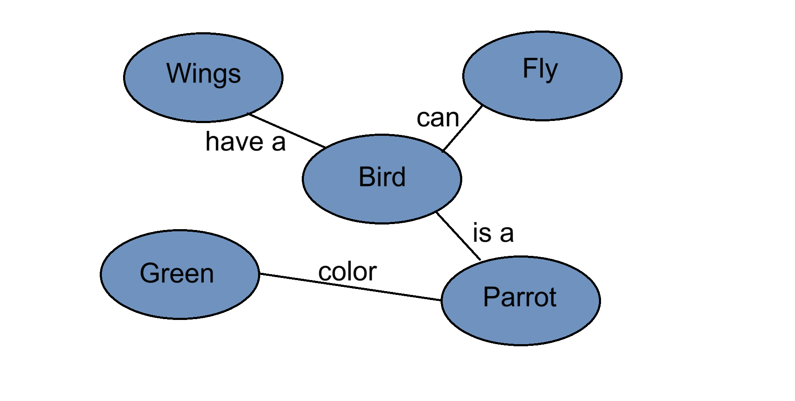

# Prolog-semantic-network
Simple Knowledge base represented as Semantic network , with Prolog language.

## Semantic network :

### Code :
- [Main code with facts and rules](code.pl)
- [Basic query](query.pl)

---
This simple project related with Artificial intelligence course in taif university

## Credits :
[0xSaad](https://x.com/0xdonzdev)
